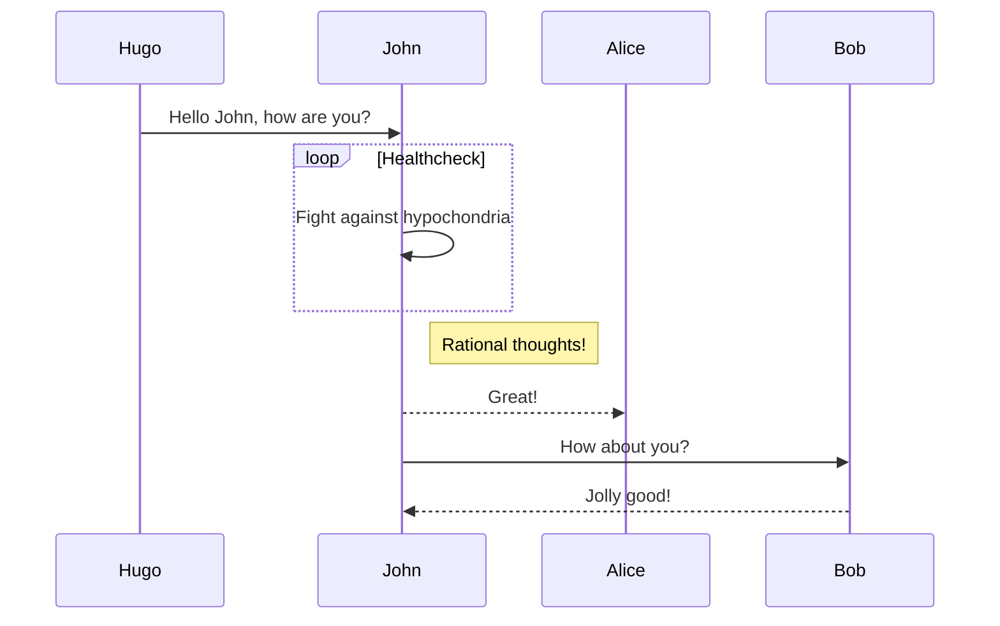
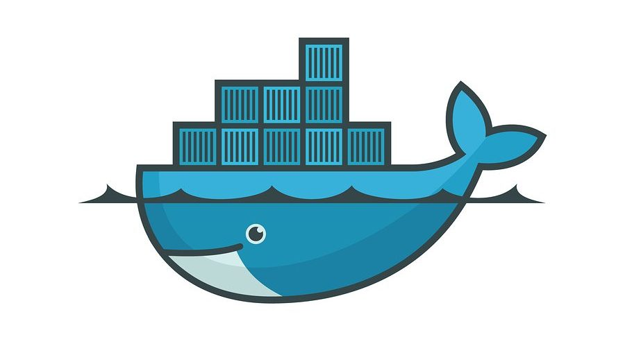

# CarRent

## Commands

* `mkdocs new [dir-name]` - Create a new project.
  * asdf
* `mkdocs serve` - Start the live-reloading docs server.
* `mkdocs build` - Build the documentation site.
* `mkdocs -h` - Print help message and exit.
* adsfasdf

1. a
   1. dasdf
   1. asd
2. a
3. a

```csharp
public class MyClass
{

}
```



My test `c:\abc` asdf

This [Link Text](https://www.google.com).

{: style="height:150px;width:150px"}


| Column 1 | Column 2 |
|----------|:---------:|
| adsf | asdf |
| adsf | asdf |
| adsf | asdf |
| adsf | asdf |
| adsf | asdf |

!!! note
    Hallo
